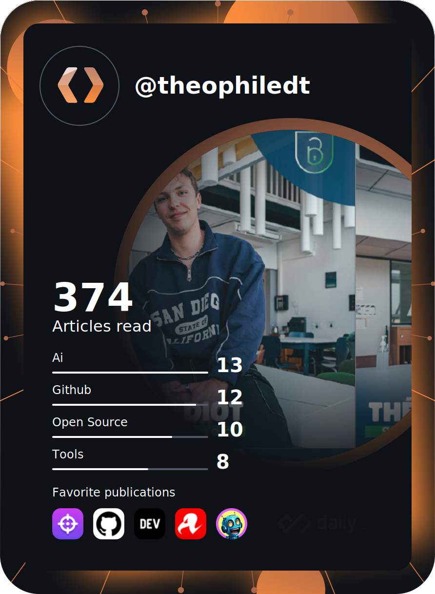

# Hi there! 

I'm Théophile Diot, I'm 24 years old and a passionate Software engineer from France 🇫🇷, I love building fun experiments and open-source projects.

**About me**

- 💼 Software Engineer at [Bunkerity](https://www.bunkerity.com/)

- 📈 Built Omnitron and is working on the next generation WAF called [BunkerWeb](https://www.bunkerweb.io)

- ❤️ I love writing in Python, and creating fun projects with it

---

### 📈 GitHub Stats

|  |  |
| ---------------------------------------------------------------------------------------------------------------------------------------------------------------------------------------------------------------------- | ------------------------------------------------------------------------------------------------------------------------------------------------------- |

#### :zap: Recent Activity

<!--START_SECTION:activity-->
1. 🗣 Commented on [#551](https://github.com/cjbarber/ToolsOfTheTrade/pull/551#issuecomment-4212110898) in [cjbarber/ToolsOfTheTrade](https://github.com/cjbarber/ToolsOfTheTrade)
2. 💪 Opened PR [#4791](undefined) in [cncf/landscape](https://github.com/cncf/landscape)
3. ❌ Labeled PR [#3414](undefined) in [bunkerity/bunkerweb](https://github.com/bunkerity/bunkerweb)
4. ❌ Assigned PR [#3414](undefined) in [bunkerity/bunkerweb](https://github.com/bunkerity/bunkerweb)
5. ❌ Assigned PR [#3414](undefined) in [bunkerity/bunkerweb](https://github.com/bunkerity/bunkerweb)
6. 🗣 Commented on [#3407](https://github.com/bunkerity/bunkerweb/issues/3407#issuecomment-4197808472) in [bunkerity/bunkerweb](https://github.com/bunkerity/bunkerweb)
7.  Labeled issue [#3407](https://github.com/bunkerity/bunkerweb/issues/3407) in [bunkerity/bunkerweb](https://github.com/bunkerity/bunkerweb)
8.  Assigned issue [#3407](https://github.com/bunkerity/bunkerweb/issues/3407) in [bunkerity/bunkerweb](https://github.com/bunkerity/bunkerweb)
9. 🗣 Commented on [#3298](https://github.com/bunkerity/bunkerweb/issues/3298#issuecomment-4172094468) in [bunkerity/bunkerweb](https://github.com/bunkerity/bunkerweb)
10. 🔓 Reopened issue [#3298](https://github.com/bunkerity/bunkerweb/issues/3298) in [bunkerity/bunkerweb](https://github.com/bunkerity/bunkerweb)
<!--END_SECTION:activity-->

---

### 🔧 Top Repositories

---

### 🎉 Other things

#### 📈 Wakatime Stats

#### 👨‍💻 Dev Card

