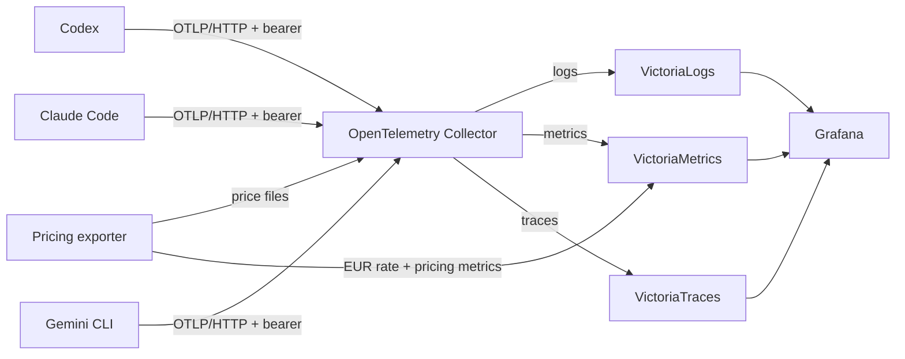

<table>
  <tr>
    <td width="44%" valign="top">
      
THEOPHILE DIOT OPEN-SOURCE SOFTWARE ENGINEER

      <h1>Théophile Diot</h1>
      
I build open-source software for web security and developer tools.

      

        Software Engineer at <a href="https://www.bunkerity.com/">Bunkerity</a> 
        Maintainer of <a href="https://github.com/bunkerity/bunkerweb">BunkerWeb</a> 
        Based in France 🇫🇷
      

      

        <a href="https://github.com/bunkerity/bunkerweb">BunkerWeb ↗</a> 
        <a href="https://github.com/TheophileDiot/ai-cli-observability">AI CLI Observability ↗</a> 
        <a href="https://www.linkedin.com/in/theophile-diot/">LinkedIn ↗</a> 
        <a href="mailto:github.zouoy@passmail.net">Email ↗</a>
      

    </td>
    <td width="56%" valign="top">
      
NOW / CURRENT FIELD NOTE

      <h2>BunkerWeb</h2>
      

        At Bunkerity, I maintain BunkerWeb, support its community, and ship releases across Linux,
        Docker, Swarm, and Kubernetes.
      

      

        <code>Python</code>
        <code>Lua</code>
        <code>NGINX</code>
        <code>Docker</code>
        <code>Kubernetes</code>
      

    </td>
  </tr>
</table>

## Selected work

<table>
  <tr>
    <td width="24%" valign="top">
      
PROJECT 01

      
<strong>MAINTAINER</strong>

      

        <code>Python</code> 
        <code>Lua</code> 
        <code>NGINX</code> 
        <code>Docker</code> 
        <code>Kubernetes</code>
      

    </td>
    <td width="76%" valign="top">
      <h3>BunkerWeb</h3>
      

        An open-source, cloud-native Web Application Firewall for secure-by-default web services.
        It runs on NGINX and integrates with existing environments.
      

      

        <a href="https://github.com/bunkerity/bunkerweb">Repository ↗</a> ·
        <a href="https://docs.bunkerweb.io/">Documentation ↗</a> ·
        <a href="https://demo.bunkerweb.io/">Live demo ↗</a>
      

    </td>
  </tr>
  <tr>
    <td width="24%" valign="top">
      
PROJECT 02

      
<strong>PERSONAL PROJECT</strong>

      

        <code>OpenTelemetry</code> 
        <code>Grafana</code> 
        <code>Docker Compose</code>
      

    </td>
    <td width="76%" valign="top">
      <h3>AI CLI Observability</h3>
      

        A self-hosted observability stack for Codex, Claude Code, and Gemini CLI.
        One Grafana view covers usage, latency, errors, tokens, traces, and estimated API-equivalent cost.
      

      

        <a href="https://github.com/TheophileDiot/ai-cli-observability">Repository ↗</a> ·
        <a href="https://github.com/TheophileDiot/ai-cli-observability#architecture">Architecture ↗</a>
      

    </td>
  </tr>
</table>

  
<strong>Technical annex</strong> · AI CLI Observability system map

Codex, Claude Code, and Gemini CLI send OTLP/HTTP to an OpenTelemetry Collector.
The collector routes logs to VictoriaLogs, metrics to VictoriaMetrics, and traces to VictoriaTraces; Grafana reads each store.
A pricing exporter supplies model prices and the USD-to-EUR rate.

```mermaid
flowchart LR
    C[Codex] -->|OTLP/HTTP + bearer| O[OpenTelemetry Collector]
    A[Claude Code] -->|OTLP/HTTP + bearer| O
    G[Gemini CLI] -->|OTLP/HTTP + bearer| O
    P[Pricing exporter] -->|price files| O
    P -->|EUR rate + pricing metrics| M[VictoriaMetrics]
    O -->|logs| L[VictoriaLogs]
    O -->|metrics| M
    O -->|traces| T[VictoriaTraces]
    L --> D[Grafana]
    M --> D
    T --> D
```

## Signals

<table>
  <tr>
    <td width="34%" valign="top">
      
BUNKERWEB

      
    </td>
    <td width="33%" valign="top">
      
WORK

      <a href="https://github.com/TheophileDiot?tab=repositories">Public repositories ↗</a>
    </td>
    <td width="33%" valign="top">
      
ACTIVITY

      Every 30 minutes
    </td>
  </tr>
</table>

## Toolkit

`Python` · `Lua` · `Docker` · `NGINX` · `Kubernetes` · `Linux`

  
<strong>Recent public activity</strong> · updated every 30 minutes

<!-- This block is rewritten every 30 minutes by .github/workflows/activity.yml.
     The `undefined` placeholders that occasionally appear in PR links are an
     upstream quirk of jamesgeorge007/github-activity-readme — do not "fix" them here. -->

<!--START_SECTION:activity-->
1. ❌ Merged PR [#61](undefined) in [shospodarets/awesome-platform-engineering](https://github.com/shospodarets/awesome-platform-engineering)
2. 💪 Opened PR [#150](undefined) in [rootsongjc/awesome-cloud-native](https://github.com/rootsongjc/awesome-cloud-native)
3. 💪 Opened PR [#61](undefined) in [shospodarets/awesome-platform-engineering](https://github.com/shospodarets/awesome-platform-engineering)
4. 💪 Opened PR [#51](undefined) in [fabionoth/awesome-cyber-security](https://github.com/fabionoth/awesome-cyber-security)
5. 💪 Opened PR [#76](undefined) in [agile6v/awesome-nginx](https://github.com/agile6v/awesome-nginx)
6. 💪 Opened PR [#150](undefined) in [johnjago/awesome-free-software](https://github.com/johnjago/awesome-free-software)
7. 💪 Opened PR [#591](undefined) in [trimstray/the-book-of-secret-knowledge](https://github.com/trimstray/the-book-of-secret-knowledge)
8. ❌ Merged PR [#3812](undefined) in [bunkerity/bunkerweb](https://github.com/bunkerity/bunkerweb)
9. 💪 Opened PR [#3812](undefined) in [bunkerity/bunkerweb](https://github.com/bunkerity/bunkerweb)
10. ❌ Merged PR [#3811](undefined) in [bunkerity/bunkerweb](https://github.com/bunkerity/bunkerweb)
<!--END_SECTION:activity-->

---

If you work on open source, web security, or developer infrastructure, say hello.

<a href="https://www.linkedin.com/in/theophile-diot/">LinkedIn</a> ·
<a href="https://www.bunkerweb.io">BunkerWeb</a> ·
<a href="mailto:github.zouoy@passmail.net">Email</a>
